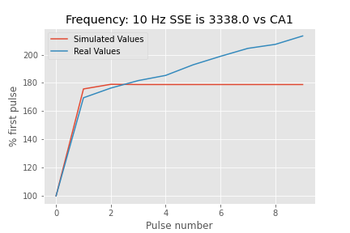

# Frequency Facilitation Sample
This is a basic dynamical system equation model. It takes basic parameters of the readily releaseable pool and probability of release and generates graphs of the responsesat various frequencys. It also compares these values to existing data as a sum-square error. It is currently rate locked at 1000 samples per second. Adjustment of this should invovle altering the various parameters.

This code is based on the following equations from Chuang-Chung J Lee 1, Mihai Anton, Chi-Sang Poon, Gregory J McRae 2009 

A likely output input and output are included below for frequency facilitation in the CA1.

CA1 output at 10Hz of a model found through a large scale state-space search.
 

